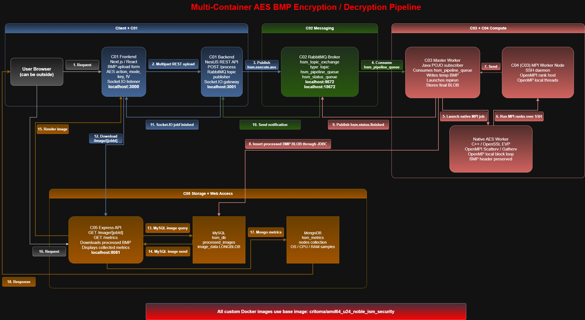

# Multi-Container AES Image Processing Pipeline

This project implements a distributed BMP encryption and decryption pipeline using Docker, RabbitMQ, Java, OpenMPI, OpenMP, OpenSSL AES, MySQL, MongoDB, Node.js, NestJS, and Next.js.

All custom containers are built from:

```text
critoma/amd64_u24_noble_ism_security
```

## Architecture

The diagrams.net architecture file is available at:

```text
architecture.drawio
```



Open it with diagrams.net, draw.io, Visio-compatible import tools, or the draw.io VS Code extension.

## Containers

The application runs these services:

| Container | Service | Role |
| --- | --- | --- |
| C01 | `c01_frontend` | Next.js frontend for BMP upload, AES parameters, status, and download trigger |
| C01 | `c01_backend` | NestJS REST API and WebSocket gateway |
| C02 | `c02_broker` | RabbitMQ broker with topic exchange and queues |
| C03 | `c03_master` | Java RabbitMQ subscriber, MPI launcher, MySQL writer |
| C04 | `c04_worker` | SSH-accessible OpenMPI worker node |
| C05 | `c05_storage` | MySQL BLOB storage, MongoDB SNMP metrics store, Express REST API |

## Runtime Flow

1. The user opens the frontend at `http://localhost:3000`.
2. The user selects a `.bmp` file and AES parameters: operation, mode, key, and IV when required.
3. The frontend sends a multipart REST request to C01 backend:

```text
POST http://localhost:3001/process
```

4. C01 backend validates the request and publishes the job to RabbitMQ through the topic exchange:

```text
exchange: hsm_topic_exchange
type: topic
routing key: hsm.execute.aes
queue: hsm_pipeline_queue
```

5. C03 Java subscriber consumes `hsm_pipeline_queue`, decodes the BMP payload, writes a temporary input BMP, and launches the native MPI worker with `mpirun`.
6. OpenMPI distributes BMP pixel data between C03 and C04.
7. Each MPI rank runs the native C++ AES worker. OpenMP is used inside each rank to process local blocks in parallel.
8. The native worker preserves the BMP header and metadata, processes the pixel bytes, gathers the result, and writes the output BMP.
9. C03 reads the processed BMP and stores it into C05 MySQL as a `LONGBLOB` in the `processed_images` table.
10. C03 publishes a completion message back through RabbitMQ:

```text
exchange: hsm_topic_exchange
routing key: hsm.status.finished
queue: hsm_status_queue
```

11. C01 backend receives the status message and emits a Socket.IO event to the frontend.
12. The frontend downloads the processed BMP from C05:

```text
GET http://localhost:8081/image/{jobId}
```

13. C05 polls SNMP agents from all application containers, stores OS, CPU, and RAM samples into MongoDB, and exposes them through:

```text
GET http://localhost:8081/metrics
```

## Build And Run

Windows:

```bat
run.bat
```

Linux/macOS/Git Bash:

```bash
sh run.sh
```

Manual commands:

```bash
docker compose build
docker compose up
```

## Useful URLs

| URL | Purpose |
| --- | --- |
| `http://localhost:3000` | Frontend |
| `http://localhost:3001/process` | C01 REST API |
| `http://localhost:8081/image/{jobId}` | Download processed BMP |
| `http://localhost:8081/metrics` | Metrics API |
| `http://localhost:15672` | RabbitMQ management UI |

RabbitMQ credentials:

```text
guest / guest
```

## AES Notes

The native worker supports AES key lengths of 16, 24, and 32 bytes. The frontend supports these AES modes:

```text
ECB, CBC, CTR, CFB, OFB, GCM
```

ECB and CTR are the most natural modes for independent parallel block processing. For the other modes, I prioritized parallelization, thus obtaining hybrid versions of each mode, effectively being applied to multiple instances.
